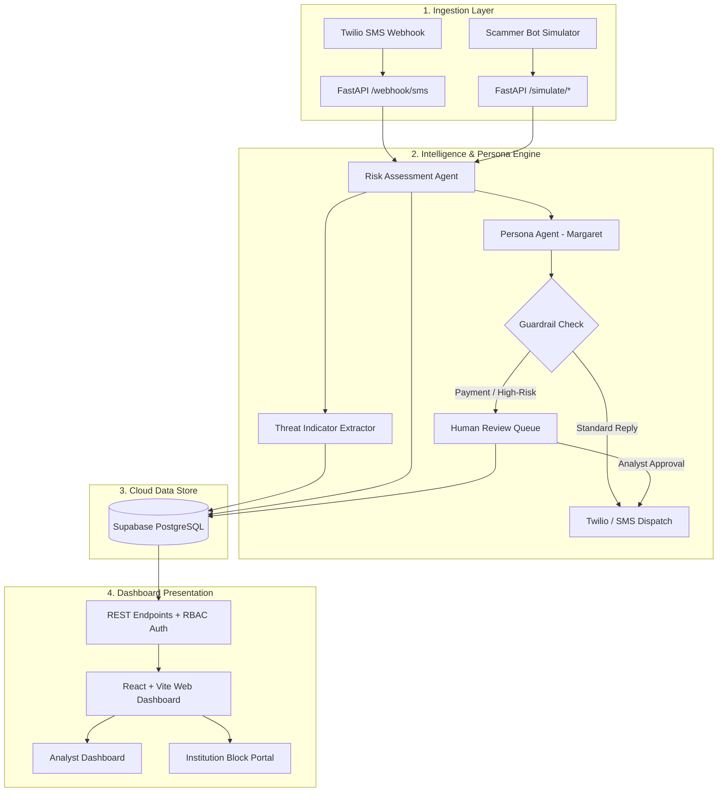

# 🛡️ TrapLine (BEESAFE.AI)
### Autonomous AI Honeypot & B2B Fraud Intelligence Platform

[](https://traplineai.vercel.app)
[](https://trapline-backend.onrender.com/health)
[](https://supabase.com)
[](https://aistudio.google.com)
[](LICENSE)

---

## 📌 Live Demo & Endpoints

* **🌐 Live Dashboard**: [https://traplineai.vercel.app](https://traplineai.vercel.app)
* **⚡ Live API Backend**: [https://trapline-backend.onrender.com](https://trapline-backend.onrender.com)
* **🏥 API Health Check**: [https://trapline-backend.onrender.com/health](https://trapline-backend.onrender.com/health)

---

## 📖 Executive Summary

**TrapLine (BEESAFE.AI)** turns passive scam victimhood into active, automated cyber intelligence gathering. 

Traditional anti-fraud solutions only block or warn victims. TrapLine deploys **autonomous AI honeypot personas** (such as *"Margaret"*, a 68-year-old retired schoolteacher) that actively engage financial scammers across SMS and messaging channels. As the scammer attempts to manipulate the persona, TrapLine:
1. **Wastes Scammer Time & Resources**: Keeps fraudsters engaged in realistic multi-turn dialogues.
2. **Extracts High-Value Threat Indicators (IOCs)**: Harvests crypto wallet addresses (BTC, ETH), malicious URLs/domains, mule bank accounts, Zelle/CashApp handles, and phone numbers in real-time.
3. **Assesses Scam Risk Dynamically**: Calculates real-time risk scores (0–100) using Bayesian/Gemini NLP classifiers (Pig Butchering, Impersonation, Urgent Wire Fraud).
4. **Feeds B2B Partners**: Enables banks, crypto exchanges, and telecoms to inspect threat feeds and execute **1-click automated blocking** to protect actual citizens.
5. **Human-in-the-Loop Safety Guardrails**: Automatically pauses and routes high-risk replies (payment claims, off-platform movement) to an analyst **Review Queue** before messages are dispatched.

---

## 📸 Platform Screenshots

### 1. Analyst Operations Dashboard
Monitor live decoy conversations, active channel streams (SMS vs. Simulation), real-time risk meters, and trigger automated simulation runs.


---

### 2. B2B Institution View & Actionable Threat Feed
A dedicated portal for partner financial institutions, crypto exchanges, and telcos to view extracted IOCs with multi-conversation frequency counts and enforce instant network-wide blocks.


---

### 3. Automated Threat Indicator Extraction
Real-time regex, heuristic, and multimodal NLP extractors detect and normalize cryptocurrency addresses, payment handles, and phishing links directly out of scammer messages.


---

## 🏗️ System Architecture



---

## ⚡ Role-Based Access Control (RBAC)

TrapLine uses header-based API key authentication (`x-api-key`) with granular permission tiers:

| Role | Default Demo Key | Allowed Operations |
| :--- | :--- | :--- |
| **👑 Super Admin** | `trapline_admin_secret_key` | Full control: View conversations, run simulations, approve review queue, block indicators, reset data. |
| **🕵️ Fraud Analyst** | `trapline_analyst_secret_key` | Investigate scam threads, approve/edit persona replies in the Review Queue, inspect threat indicators. |
| **🏦 Institution Viewer** | `trapline_institution_secret_key` | Clean B2B partner view: View threat intelligence feeds, crypto wallets, and execute 1-click IOC blocks. *(No access to raw victim chat transcripts).* |

---

## 🛠️ Technology Stack

* **Backend**:
  * [FastAPI](https://fastapi.tiangolo.com/) – High-performance asynchronous REST API
  * [SQLAlchemy 2.0](https://www.sqlalchemy.org/) + [Alembic](https://alembic.sqlalchemy.org/) – ORM & automated database migrations
  * [Google GenAI SDK](https://github.com/google/generative-ai-python) – Gemini 2.5 / Flash-Lite persona reasoning & risk classification
  * [Twilio SDK](https://www.twilio.com/) – Real-time two-way SMS messaging with cryptographic signature verification
  * [Pydantic v2](https://docs.pydantic.dev/) – Strict data validation and schema serialization

* **Frontend**:
  * [React 18](https://react.dev/) + [Vite](https://vitejs.dev/) – Fast Single Page Application
  * [Tailwind CSS](https://tailwindcss.com/) – Custom cyber defense styling and responsive layouts
  * [Lucide React](https://lucide.dev/) – Modern security iconography

* **Cloud Infrastructure**:
  * **Frontend Host**: [Vercel](https://vercel.com) (Global Edge CDN with reverse-proxy rewrites)
  * **API Host**: [Render](https://render.com) (Python Uvicorn service container)
  * **Database**: [Supabase](https://supabase.com) (Managed serverless PostgreSQL with IPv4 Session Pooler)

---

## 🚀 Local Development Setup

### 1. Clone Repository
```bash
git clone https://github.com/SaiRanjithR/BEESAFE_AI.git
cd BEESAFE_AI
```

### 2. Backend Setup
```bash
# Create and activate virtual environment
python3 -m venv .venv
source .venv/bin/activate

# Install dependencies
pip install -r backend/requirements.txt

# Configure environment variables
cp .env.example .env
# Edit .env and supply your GEMINI_API_KEY and DATABASE_URL
```

Run the backend server:
```bash
PYTHONPATH=backend uvicorn app.main:app --host 127.0.0.1 --port 8000 --reload
```

Verify backend health:
```bash
curl http://127.0.0.1:8000/health
```

### 3. Frontend Setup
```bash
cd frontend
npm install
npm run dev
```
Open **`http://localhost:5173`** in your browser.

---

## 🧪 Testing & Scammer Simulation

You can test the platform without a live phone number using the terminal webhook simulator:

```bash
# Simulate an incoming scam text with a crypto wallet & urgency:
curl -X POST http://127.0.0.1:8000/webhook/sms \
  -d "From=+15551234567" \
  -d "To=+17372508034" \
  -d "Body=Urgent: Wire 500 dollars to crypto wallet 0x71C63303741cAE444856075c0c457bf433270c35" \
  -d "MessageSid=SMtest101"
```

The system will:
1. Ingest the text as an active live channel conversation.
2. Automatically parse and extract the Ethereum wallet address (`0x71C6...`).
3. Generate Margaret's persona response.
4. Detect the payment demand and hold the reply in the **Review Queue** for analyst confirmation.

---

## 📜 License

Distributed under the MIT License. See `LICENSE` for more information.
