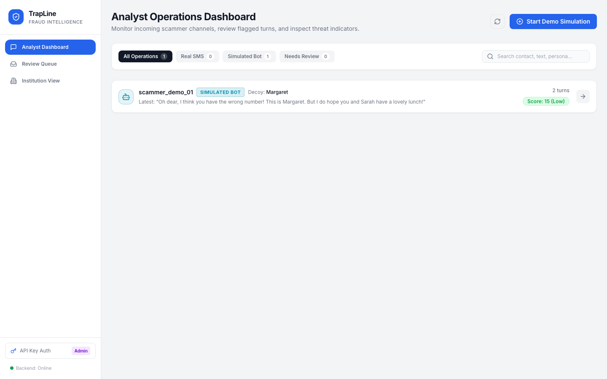
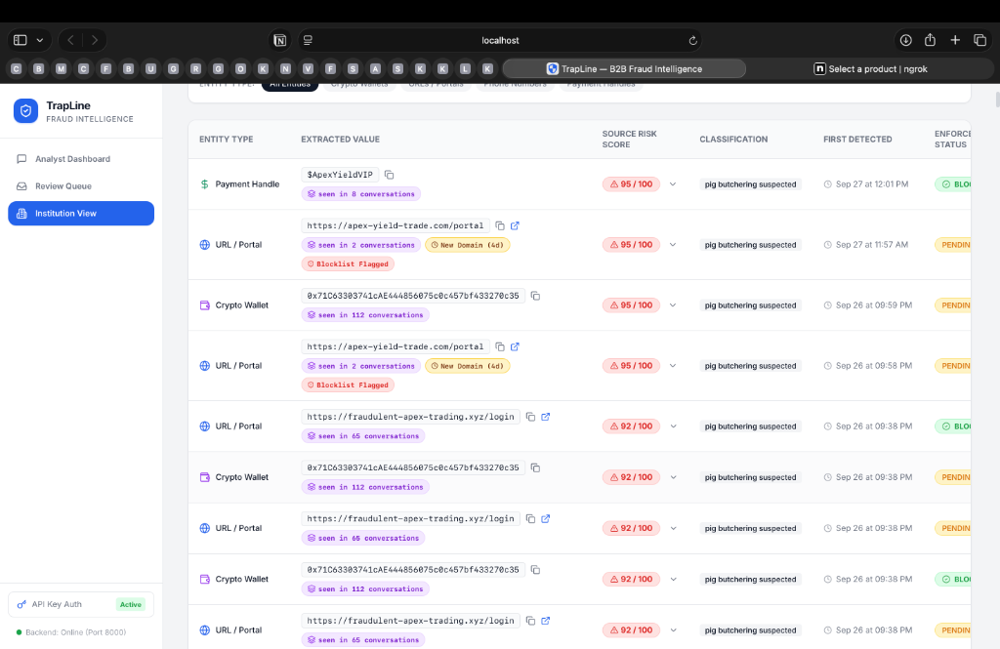
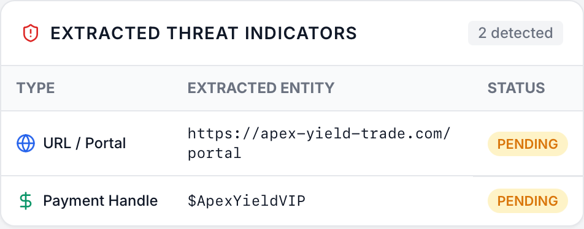

# 🛡️ TrapLine (BEESAFE.AI)
### Autonomous AI Honeypot & B2B Fraud Intelligence Platform

**Live Application:** [https://traplineai.vercel.app](https://traplineai.vercel.app)  
**Production API:** [https://trapline-backend.onrender.com](https://trapline-backend.onrender.com)

---

## 📌 What is TrapLine?

**TrapLine** is an autonomous B2B fraud intelligence system that turns passive scam defense into active, proactive counter-intelligence.

Instead of waiting for victims to get defrauded, TrapLine deploys **autonomous AI honeypot personas** (such as *"Margaret"*, a polite 68-year-old retired teacher) to engage suspected scammers in realistic multi-turn text conversations. 

As scammers attempt to manipulate the AI persona, TrapLine wastes their time, baits them into revealing their underlying financial infrastructure (mule bank accounts, crypto wallets, phishing portals, and payment handles), and immediately delivers those verified indicators to financial institutions and telecoms to block them.

---

## 🚨 The Problem It Solves

Trust-based financial fraud—including **pig butchering, romance scams, and crypto investment schemes**—bypasses traditional bank fraud detection:

1. **Victim-Authorized Transfers**: Traditional fraud rules look for unauthorized card charges or account takeovers. But in social engineering scams, the victim **willingly authorizes** the wire or crypto transfer after weeks of grooming.
2. **Too Late for Recovery**: Banks, exchanges, and telecoms typically learn about a scam only **after** the victim realizes they have been defrauded and files a police report. By then, the money has already bounced through mule accounts and disappeared into crypto tumblers.
3. **Reactive vs. Proactive**: Scammers operate with zero friction because their payment accounts and malicious links remain active until reported.

---

## 💡 How TrapLine Solves It

TrapLine stops scams **before** real victims lose money:

* **AI Decoy Persona Engine**: Autonomous agents stay in character over multi-turn SMS and chats, sounding convincingly vulnerable without ever sharing real money or sensitive personal information.
* **Automated Threat Harvesting (IOC Extraction)**: Every message is scanned in real-time using NLP and regex to extract crypto wallets (BTC/ETH), CashApp/Zelle handles, bank details, and phishing links.
* **Multi-Conversation Correlation**: Tracks when the same crypto wallet, domain, or phone number is reused across multiple scam operations.
* **Human-in-the-Loop Review Queue**: Strict safety guardrail—any AI response involving payments or off-platform movement is paused in a queue for human analyst authorization before being dispatched.
* **1-Click Institution Blocking**: Banks and crypto exchanges get an actionable dashboard where they can instantly mark mule accounts and wallets as **Blocked** across their networks.

---

## 📸 Platform Screenshots

### 1. Analyst Operations Dashboard
Real-time command center showing all active scammer engagements (real SMS and simulated bots), live scam risk scoring (0–100), and conversation status.



---

### 2. B2B Institution View & 1-Click Blocking
The interface designed for partner banks, crypto exchanges, and telcos to review extracted Indicators of Compromise (IOCs) and execute immediate blocking actions.



---

### 3. Automated Threat Indicator Extraction
Normalized threat extraction pulling cryptocurrency wallet addresses, phishing URLs, and payment handles directly from scammer dialogues.



---

## 👥 Role-Based Access Control (RBAC)

TrapLine provides three distinct access tiers out-of-the-box:

* **👑 Admin (`trapline_admin_secret_key`)**: Full platform control (simulations, conversations, review queue, indicators, and configuration).
* **🕵️ Fraud Analyst (`trapline_analyst_secret_key`)**: Daily operations view to monitor conversations and approve or edit held replies in the Review Queue.
* **🏦 Institution Viewer (`trapline_institution_secret_key`)**: Clean B2B partner feed allowing banks and telcos to view threat intelligence and block indicators without exposing private victim chat logs.

---

## ⚡ Quick Test (Without a Phone Number)

You can simulate a scammer hitting the backend with a single curl command:

```bash
curl -X POST https://trapline-backend.onrender.com/webhook/sms \
  -d "From=+15551234567" \
  -d "To=+17372508034" \
  -d "Body=Urgent: Send 500 dollars to crypto wallet 0x71C63303741cAE444856075c0c457bf433270c35" \
  -d "MessageSid=SMdemo101"
```

1. The backend automatically extracts the Ethereum wallet `0x71C63303741cAE444856075c0c457bf433270c35`.
2. Margaret's AI response is generated.
3. The response is automatically placed in the **Review Queue** because it involves a financial request.
4. The wallet appears immediately in the **Institution View** ready to be blocked.
